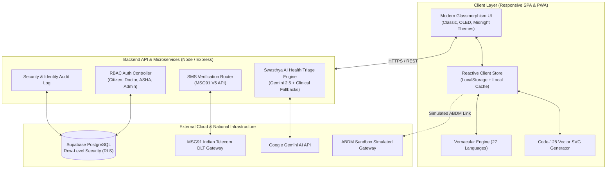

# 🌾 Swasthya Setu (स्वास्थ्य सेतु)
### *Rural Care Access & Quality Network · Unified Telemedicine & ABDM Health Grid*

[](https://opensource.org/licenses/MIT)
[](https://abdm.gov.in/)
[](#-27-indian-languages-vernacular-engine)
[](#-offline-first-architecture)
[-emerald.svg)](#-automated-testing-suite)
[](#-tech-stack)

*Bridging India's rural-urban healthcare divide with offline-first telemedicine, real-time AI triage, ASHA frontline workflows, Jan Aushadhi generic mapping, and Ayushman Bharat (ABDM) integration.*

[Explore Portals](#-four-interconnected-portals) • [Key Innovations](#-key-innovations) • [Architecture](#-system-architecture) • [Quickstart](#-quickstart--local-development) • [Live Deployment](#-deployment-guide)

---

## 📌 Executive Overview

Over **68% of India's population** resides in rural villages, yet more than **75% of doctors and healthcare infrastructure** are concentrated in metropolitan cities. Rural citizens face extreme hurdles:
- **Delayed emergency response & long transit times** to district hospitals.
- **Catastrophic out-of-pocket drug costs** from expensive branded medicines.
- **Unreliable rural internet connectivity (2G/intermittent)** crippling web apps.
- **Language barriers** across diverse regional communities.
- **Fragmented medical history** lacking interoperable Ayushman Bharat (ABDM) integration.

**Swasthya Setu** is an open, production-ready digital health grid engineered specifically for these constraints. It connects rural citizens, grassroots ASHA health workers, district hospital doctors, and administrative command centers into a unified, secure ecosystem.

---

## 🏛️ Four Interconnected Portals

Swasthya Setu provides four dedicated, role-based interfaces sharing a real-time reactive state:

```
                  ┌────────────────────────────────────────┐
                  │      Swasthya Setu Unified Grid        │
                  └───────────────────┬────────────────────┘
                                      │
        ┌───────────────┬─────────────┴───────────────┬───────────────┐
        ▼               ▼                             ▼               ▼
┌──────────────┐ ┌──────────────┐             ┌──────────────┐ ┌──────────────┐
│   Citizen    │ │     ASHA     │             │    Doctor    │ │    Admin     │
│   Patient    │ │  Frontline   │             │ Telemedicine │ │   Command    │
│    Portal    │ │    Worker    │             │    Suite     │ │    Center    │
└──────────────┘ └──────────────┘             └──────────────┘ └──────────────┘
```

### 1. 🌾 Citizen & Patient Hub
* **Digital ABHA Health Card**: Instant display of 14-digit Ayushman Bharat Health Account (ABHA ID), photo, and QR/barcode identifiers with one-click toggle and secure credentials.
* **Swasthya AI Health Triage**: Dual-engine clinical triage (powered by Google Gemini API with fallback clinical deterministic protocols). Segregates cases into:
  - 🔴 **EMERGENCY (Red)**: Instant 108 SOS trigger with vitals guidance.
  - 🟡 **URGENT (Yellow)**: Scheduled teleconsultation slot within 24 hours.
  - 🟢 **ROUTINE (Green)**: Verified home-care, self-monitoring, and hydration advice.
* **108 Emergency SOS & Live GPS HUD**: Real-time ambulance tracking, driver contact, vehicle registration (`UP 20 G 1082`), countdown ETA, and automated village landmark transmitter.
* **Jan Aushadhi Generic Savings Calculator**: Automatically identifies generic equivalents for common branded prescriptions (saving up to 80% on everyday healthcare costs).
* **e-Prescription Locker with Vector PDF & Barcode**: Patients can view doctor prescriptions, download high-contrast vector PDFs, and scan Code-128 barcodes at local Jan Aushadhi kendras.
* **Daily Medication Adherence Checklist**: Morning, noon, and night dose tracking with local persistence.

---

### 2. 🤝 ASHA / ANM Frontline Worker Portal
* **Rural Caseload Management**: Track active village households, high-risk cases, and upcoming visits.
* **High-Risk Maternal ANC Registry**: Ante-Natal Care (ANC) tracking including gestational weeks, Expected Date of Delivery (EDD), hemoglobin levels, blood pressure, and Iron & Folic Acid (IFA) supplies.
* **Child Universal Immunization (UIP) Tracker**: Real-time tracking of infant vaccines (BCG, OPV, Pentavalent, Rotavirus, Measles-Rubella).
* **Daily Home Visit Street Route**: Priority-based visit planner for frontline health surveys.
* **Offline-First Vitals Capture**: Workers can record patient vitals in zero-network areas; data queues locally with AES encryption and syncs automatically upon reconnection.

---

### 3. 👨‍⚕️ Doctor Teleconsultation & Clinical Suite
* **Live OPD Patient Queue**: Priority sorting (Red/Yellow/Green triage tags) with real-time patient status updates.
* **Integrated Telemedicine WebRTC Suite**: Low-bandwidth video consultations with automated 2G audio fallback, picture-in-picture video, and live notes.
* **Dynamic Multi-Medicine e-Prescriptions**:
  - Prescribe unlimited generic formulations using the **`➕ Add Medicine`** button.
  - Choose from the built-in **Jan Aushadhi Generic Catalog** or type custom brand/generic medicines.
  - Configurable dosage schedules (e.g., `1 Tab BD after food`, `1 Tab TDS`).
  - Code-128 Barcode generation embedded directly into the prescription for pharmacy verification.
* **EMR & History Review**: Complete longitudinal patient records, vitals graphs, and previous prescriptions.

---

### 4. 🏛️ Admin Command & Health Intelligence Center
* **District Hospital Bed Grid**: Real-time bed tracking across Primary Health Centres (PHCs), Community Health Centres (CHCs), and District Hospitals (General Beds, ICU Beds, Oxygen-Supported Beds).
* **Live 8-Group Blood Bank Inventory**: Monitors available units of `A+`, `A-`, `B+`, `B-`, `O+`, `O-`, `AB+`, and `AB-`.
* **Rural Disease Surveillance Heatmap**: Real-time outbreak monitoring across rural sectors (Dengue, Malaria, Typhoid, Acute Gastroenteritis).
* **Staff Directory & Medical Officer License Verification**: Administrative approvals and role assignments for doctors and frontline workers.

---

## 🚀 Key Innovations

### ⚡ 27 Indian Languages Vernacular Engine
Healthcare in rural India cannot be English-only. Swasthya Setu features a lightweight, zero-dependency multilingual dictionary supporting **27 scheduled and regional Indian languages**:
* *Hindi (हिंदी), Telugu (తెలుగు), Tamil (தமிழ்), Bengali (বাংলা), Marathi (मराठी), Gujarati (ગુજરાતી), Kannada (ಕನ್ನಡ), Malayalam (മലയാളം), Punjabi (ਪੰਜਾਬੀ), Odia (ଓଡ଼ିଆ), Assamese (অসমীয়া), Urdu (اردو), Bhojpuri (भोजपुरी), Maithili (मैथिली), Mizo / Khasi (Lushai), Santali (ᱥᱟᱱᱛᱟᱲᱤ), Konkani (कोंकणी), Dogri (डोगरी), Kashmiri (کٲشُر), Bodo (बड़ो), Chhattisgarhi (छत्तीसगढ़ी), Haryanvi (हरियाणवी), Rajasthani (राजस्थानी), Sindhi (سنڌي), Tulu (ತುಳು).*

---

### 📜 High-Contrast Vector PDF & Scannable Code-128 Barcode
To ensure prescriptions can be verified without internet at rural medicine dispensaries:
- Custom-built, offline **Code-128 vector SVG barcode engine**.
- Encodes verifiable ABDM Rx tokens (`ABDM-RX-{ID}-{PATIENT_TOKEN}`).
- Embedded in a high-contrast, printable A4 PDF stylesheet featuring the official Ministry of Health & Family Welfare banner, prescribing doctor credentials, diagnosis, and itemized medicine dosages.

---

### 🔒 Strict Medical Privacy & RBAC Isolation
- **Conversation Context Enclave**: Patient AI health consultations are strictly isolated by session tokens and user identity.
- **Anti-IDOR Protection**: Doctors, ASHA workers, and system administrators cannot inspect private AI triage chats of other citizens.
- **Audit Logging**: Sensitive identity and query events log tamper-evident telemetry to Supabase.

---

### 📱 MSG91 Telecom DLT V5 OTP Gateway
- Integrates directly with **MSG91's official Indian DLT SMS Gateway**.
- Server-side secret isolation: `MSG91_AUTH_KEY` is never exposed to the client.
- Rate-limiting safeguards, 60-second re-request cooldowns, and opaque SHA-256 single-use tokens for forgot-password account recovery.

---

## 🏗️ System Architecture



---

## 💻 Tech Stack

| Component | Technologies Used |
|---|---|
| **Frontend Core** | Vanilla Modern JavaScript (ES6+), Reactive State Pattern, HTML5, Modular CSS3 |
| **Styling & Themes** | Custom Glassmorphism UI, CSS Variables, Triple Themes (*Classic Emerald, Dark OLED, Cyber Doom*) |
| **Teleconsultation** | WebRTC MediaStream API, PeerConnection, 2G Audio Fallback Simulation |
| **Mapping & Tracking** | Real-time GPS Geolocation API, Dynamic Distance Matrices, Custom SVG Markers |
| **Document Engine** | Pure SVG Code-128 Barcode Engine, CSS Paged Media `@page` Vector PDF Engine |
| **Backend Runtime** | Node.js (v18+), Express.js, CORS, Helmet, dotenv |
| **Database & Auth** | Supabase (PostgreSQL), Row-Level Security (RLS), JWT Session Tokens |
| **AI Health Triage** | Google Gemini API (`gemini-2.5-flash`), Deterministic Clinical Decision Trees |
| **Telecom Integration** | MSG91 DLT V5 OTP Gateway API |

---

## 🛠️ Quickstart & Local Development

### Prerequisites
- Node.js (v18.0.0 or higher)
- npm (v9.0.0 or higher)
- Modern web browser (Chrome, Edge, Firefox, Safari)

### 1. Clone the Repository
```bash
git clone https://github.com/AmanX569/Swasthya-Setu.git
cd Swasthya-setu
```

### 2. Install Server Dependencies
```bash
cd server
npm install
cd ..
```

### 3. Configure Environment Variables
Create a `.env` file inside the `server/` directory:
```env
# Port & Environment
PORT=5000
NODE_ENV=development

# AI Health Triage
GEMINI_API_KEY=your_gemini_api_key_here

# SMS OTP Provider ('msg91' for live telecom, 'sandbox' for offline local test)
OTP_PROVIDER=sandbox
MSG91_AUTH_KEY=your_msg91_auth_key_here
MSG91_OTP_TEMPLATE_ID=your_dlt_template_id_here

# Database (Supabase PostgreSQL)
SUPABASE_URL=https://your-project.supabase.co
SUPABASE_SERVICE_ROLE_KEY=your_supabase_service_role_key_here

# Security
JWT_SECRET=super_secure_development_jwt_secret_key_12345
```

### 4. Start the Application
```bash
# Start backend server
node server/app.js

# In a separate terminal or simply open in browser:
# Open index.html directly or serve using any static server:
npx serve .
```

### 5. Re-bundle Static Outputs (Optional)
If modifying files inside `frontend/`, run the bundler to sync `index.html` and `public/`:
```bash
node bundle.js
```

---

## 🧪 Automated Testing Suite

Swasthya Setu includes end-to-end automated test suites verifying medical privacy, RBAC boundaries, and telecom gateways:

### Run AI Privacy & RBAC Isolation Tests
Verifies that patient triage sessions cannot be accessed across different user roles or through IDOR injection:
```bash
node server/tests/ai-privacy-rbac.test.js
```
*Expected Result: `13 Passed, 0 Failed`*

### Run MSG91 SMS Gateway Tests
Verifies phone normalization, rate limits, cooldowns, and cryptographic challenge validation:
```bash
node server/tests/msg91.test.js
```
*Expected Result: `17 Passed, 0 Failed`*

---

## 🌐 Deployment Guide

### Deploying Frontend to GitHub Pages
1. Push your changes to GitHub `main`.
2. In your GitHub repository, go to **Settings > Pages**.
3. Under **Build and deployment > Source**, select **Deploy from a branch**.
4. Choose branch `main` and folder `/ (root)`.
5. Click **Save**. Your portal will be live at `https://<username>.github.io/<repo-name>/`.

### Deploying to Vercel
The repository includes a ready-to-deploy `vercel.json` configuration serving both the static frontend and the serverless Express API:
```bash
npx vercel --prod
```
Set environment variables (`GEMINI_API_KEY`, `SUPABASE_URL`, `SUPABASE_SERVICE_ROLE_KEY`, `MSG91_AUTH_KEY`) in the Vercel Project Settings dashboard.

---

## 👥 Default Demo Credentials

For demonstration, evaluation, and offline walkthroughs, use the pre-configured credentials:

| Portal | Login Identifier | Password / PIN | Description |
|---|---|---|---|
| **Citizen Patient** | `9876543210` or `14-8921-4402-9912` | `1234` | Ramesh Kumar (Verified Citizen Profile) |
| **Doctor** | `doctor.priya@swasthyasetu.gov.in` | `doc@123` | Dr. Priya Sharma, MBBS, MD (Kondapalli PHC) |
| **ASHA Worker** | `asha.lakshmi@swasthyasetu.gov.in` | `asha@123` | Lakshmi Didi (Sector 4 ASHA Lead) |
| **Admin Command** | `admin@swasthyasetu.gov.in` | `Aman@123` | Aman Yadav (District Chief Medical Officer) |

---

## 📜 License & Disclaimer

- **License**: Released under the [MIT License](LICENSE).
- **Clinical Disclaimer**: *Swasthya Setu's AI Triage is designed for preliminary symptom assessment and triage guidance only. It is not a substitute for professional clinical diagnosis. In life-threatening emergencies, citizens are directed to immediately call 108 or report to the nearest primary emergency care facility.*

---

<div align="center">
  <sub>Built with ❤️ for rural healthcare innovation and digital public infrastructure across India.</sub>
</div>
